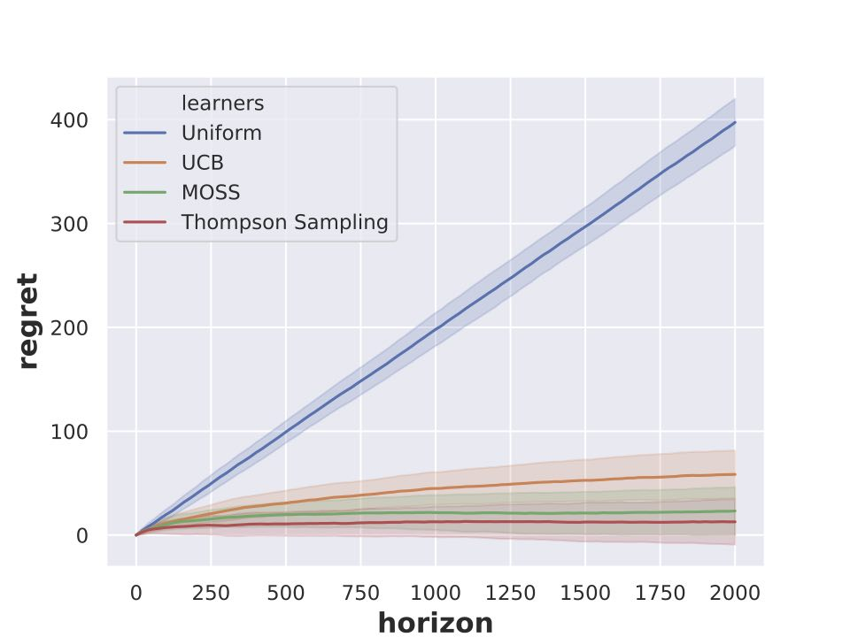

```
 _                     _ _ _               _ _ _     
| |                   | (_) |             | (_) |    
| |__   __ _ _ __   __| |_| |_ _ __  _   _| |_| |__  
| '_ \ / _` | '_ \ / _` | | __| '_ \| | | | | | '_ \ 
| |_) | (_| | | | | (_| | | |_| |_) | |_| | | | |_) |
|_.__/ \__,_|_| |_|\__,_|_|\__| .__/ \__, |_|_|_.__/ 
                              | |     __/ |          
                              |_|    |___/                
```

A lightweight python library for bandit algorithms

 

## Features

* object-oriented design
* multiprocesses support
* friendly runtime info

## Implemented Policies

### Regret Minimization

| Protocol | Bandit Type | Policies |
| :---         |     :---      |      :--- |
| Single Player   | Ordinary Bandit     | `Uniform`, `EpsGreedy`, `UCB` [[1]](#ACF02),  `MOSS` [[2]](#AB09), `TS` \[[3](#T33), [4](#KKM12)\], `UCBV` [[5]](#AMS09)  |
|      | Ordinary MNL Bandit   | `ExplorationExploitation` [[6]](#AAGZ19)      |
|      | Correlated Bandit   | `CUCB` \[[10](#GCJY18), [11](#GCJY19)\]      |
|  Decentralized [[12]](FAL18) | Ordinary Bandit   | `Uniform`, `FUCB`, `SUCB`  |

### Best Arm Identification

#### Fixed Budget

| Protocol | Bandit Type | Policies |
| :---         |     :---      |      :--- |
| Single Player   | Ordinary Bandit     | `Uniform`, `SR` [[7]](#AB10)  |

#### Fixed Confidence

| Protocol | Bandit Type | Policies |
| :---         |     :---      |      :--- |
| Single Player   | Ordinary Bandit     | `lilUCB_heur` [[8]](#JMNB14), `ExpGap` [[9]](#KKS13) |
|      | Correlated Bandit   | `LinGapE` [[13]](#XHS18)      |
|  Decentralized [[12]](FAL18) | Ordinary Bandit   | `FlilUCB_heur`, `SlilUCB_heur`  |

## Getting Started

### Configuration

Use `config.json` or `--config CONFIGFILE` to set up simulation parameters.

### Installing and Running

```shell
# run under `banditpylib` directory
# create vitual environment
python3 -m virtualenv .env
# enter virtual environment
source .env/bin/activate
# install required packages
pip3 install -r requirements.txt
# run the project
python3 main.py
# exit virtual environment
deactivate
```

The output including figure and other analysis data is put under path `out/` by default. The following figure demonstrates the result of the current config file.



### Debug

For debugging purpose or more running time info, please run with `--debug` flag. Otherwise, errors generated by subprocesses may not be revealed.

```shell
# this may heavily increase running time
python3 main.py --debug
```

## Running the Tests

```shell
# run all tests
pytest -v
```

## License

This project is licensed under the MIT License - see the [LICENSE.txt](LICENSE.txt) file for details.

## Acknowledgments

* This project is inspired by [libbandit](https://github.com/tor/libbandit) and [banditlib](https://github.com/jkomiyama/banditlib) which are both c++ libraries for bandit algorithms.
* This readme file is following the style of [README-Template.md](https://gist.github.com/PurpleBooth/109311bb0361f32d87a2).
* The title is generated by [TAAG](http://patorjk.com/software/taag/#p=display&f=Graffiti&t=Type%20Something%20).

## References

1. <a name="ACF02"></a> Peter Auer, Nicolo Cesa-Bianchi, and Paul Fischer. Finite-time analysis of the multiarmed bandit problem. Machine learning, pages 235–256, 2002.
2. <a name="AB09"></a> Jean-Yves Audibert and Sébastien Bubeck. Minimax Policies for Adversarial and Stochastic Bandits. In COLT, 2009.
3. <a name="T33"></a> William R Thompson. On the likelihood that one unknown probability exceeds another in view of the evidence of two samples. Biometrika, 25(3/4):285–294, 1933.
4. <a name="KKM12"></a> Emilie Kaufmann, Nathaniel Korda, and Rémi Munos. Thompson sampling: An asymptotically optimal finite-time analysis. In ALT, pages 199–213, 2012.
5. <a name="AMS09"></a> Jean-Yves Audibert, Rémi Munos, and Csaba Szepesvári. Exploration-exploitation tradeoff using variance estimates in multi-armed bandits. Theoretical Computer Science, 410(19):1876–1902, 2009.
6. <a name="AAGZ19"></a> Shipra Agrawal, Vashist Avadhanula, Vineet Goyal and Assaf Zeevi. MNL-bandit: A dynamic learning approach to assortment selection. Operation Research, 67(5):1453-1485, 2019.
7. <a name="AB10"></a> Jean-Yves Audibert and Sébastien Bubeck. Best arm identification in multi-armed bandits. In COLT, 2010.
8. <a name="JMNB14"></a> Kevin Jamieson, Matthew Malloy, Robert Nowak and Sébastien Bubeck. lil’ucb: An optimal exploration algorithm for multi-armed bandits. In COLT, 2014.
9. <a name="KKS13"></a> Zohar Karnin, Tomer Koren and Oren Somekh. Almost optimal exploration in multi-armed bandits. In ICML, 2013.
10. <a name="GCJY18"></a> Samarth Gupta, Shreyas Chaudhari, Gauri Joshi and Osman Yağan. Exploiting correlation in finite-armed structured bandits. 2018.
11. <a name="GCJY19"></a> Samarth Gupta, Shreyas Chaudhari, Gauri Joshi and Osman Yağan. Multi-Armed Bandits with Correlated Arms. arXiv:1911.03959, 2019.
12. <a name="FAL18"></a> Raphaël Féraud, Réda Alami and Romain Laroche. Decentralized Exploration in Multi-Armed Bandits. arXiv:1811.07763, 2018.
13. <a name="XHS18"></a> Liyuan Xu, Junya Hond and Masashi Sugiyama. Fully adaptive algorithm for pure exploration in linear bandits. In AISTATS, 2018.


## Contributors

* Chester Holtz, chholtz@eng.ucsd.edu
