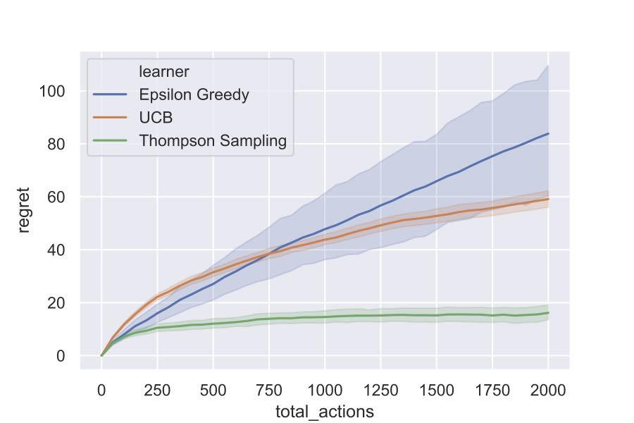

```
 _                     _ _ _               _ _ _     
| |                   | (_) |             | (_) |    
| |__   __ _ _ __   __| |_| |_ _ __  _   _| |_| |__  
| '_ \ / _` | '_ \ / _` | | __| '_ \| | | | | | '_ \ 
| |_) | (_| | | | | (_| | | |_| |_) | |_| | | | |_) |
|_.__/ \__,_|_| |_|\__,_|_|\__| .__/ \__, |_|_|_.__/ 
                              | |     __/ |          
                              |_|    |___/                
```

A lightweight python library for bandit algorithms

 

## Introduction

This library is intended to enable fast and robust comparison between different bandit algorithms. It provides following features:

* object-oriented design: this allows unnecessary environmental information to be hidden from learners. Besides, it is easy extend the library and implement new algorithms.
* multi-process support: it is not uncommon to run a game muitiple repetitions. One can run multiple repetitions simultaneously with this feature.
* friendly runtime information: useful information is provided when necessary, which reduces the difficulty of debug. 

The library consists of four submodules and they are `arms`, `bandits`, `learners` and `protocols` respectively, among which `protocols` are those used to coordinate the interactions between the learner and the bandit environment.

## Implemented Policies

### Single player protocol

#### Multi-armed bandit

| Goal | Policies |
|     :---      |      :--- |
| Maximize total rewards  | `Uniform`, `EpsGreedy`, `UCB`, `ThompsonSampling`, `UCBV`, `MOSS`, `EXP3`, `ExploreThenCommit`, `Softmax` |
| Best arm identification with fixed budget   | `Uniform`, `SR`, `SH`|
| Best arm identification with fixed confidence   | `ExpGap`, `LilUCBHeuristic`|

#### MNL bandit

| Goal | Policies |
|     :---      |      :--- |
| Maximize total rewards  | `EpsGreedy`, `UCB`, `ThompsonSampling` |

#### Thresholding bandit

| Goal | Policies |
|     :---      |      :--- |
| Make all answers correct | `Uniform`, `APT` |

#### Linear bandit

| Goal | Policies |
|     :---      |      :--- |
| Maximize total rewards  | `LinUCB` |

### Colaborative learning protocol

#### Multi-armed bandit

| Goal | Policies |
|     :---      |      :--- |
| Best arm identification with fixed time  | `LilUCBHeuristicCollaborative` |

For a detailed description, please check the [documentation](https://alanthink.github.io/banditpylib-doc/).

## Getting Started

### Installing

Python version requirement: 3.7 or above.

Virtual environment: in order not to pollute your own environment, it is suggested to use python virtual environment. The following commands show the details to create and activate a virtual environment.

```Bash
# Create a virtual environment `.env`
python3 -m venv .env
# Activate the environment
source .env/bin/activate
```

Then you can run the following command to install the `banditpylib` library.

```Bash
make install
```

After finishing the usage of the library, you can use `deactivate` to deactive the virtual environment and what's more, you can safely delete the whole `.env` directory for cleanup.

The following shows other useful make commands.

```Bash
make test
       run tests
make lint
       run pylint and mypy
make clean
       clean cache files
make fix
       run yapf to format all .py files
```

We use `pylint` and `mypy` to check the code style. Please make sure no errors occur with `make lint` when submitting a PR.

### Example

Suppose we want to run algorithms *Epsilon Greedy*, *UCB* and *Thompson Sampling*, which aim to maximize the total rewards, against the ordinary multi-armed bandit environment with 3 *Bernoulli* arms. The following code blocks show the main logic. 

#### Set up bandit environment

```Python
# Real means of Bernoulli arms
means = [0.3, 0.5, 0.7]
# Create Bernoulli arms
arms = [BernoulliArm(mean) for mean in means]
# Create an ordinary multi-armed bandit environment
bandit = MultiArmedBandit(arms=arms)
```

#### Set up learners

```Python
# Create learners aiming to maximize the total rewards
learners = [EpsGreedy(arm_num=len(arms)),
            UCB(arm_num=len(arms)),
            ThompsonSampling(arm_num=len(arms))]
```

#### Set up simulator and play the game

```Python
# Horizon of the game
horizon = 2000
# Record intermediate regrets for each trial
intermediate_regrets = list(range(0, horizon+1, 50))
# Set up simulator using single-player protocol
game = SinglePlayerProtocol(bandit=bandit,
                            learners=learners,
                            intermediate_regrets=intermediate_regrets,
                            horizon=horizon)
# Start playing the game and for each setup we run 200 trials
game.play(trials=200)
```

The following figure shows the simulation results.



Please check this [notebook](examples/multi_armed_bandit.ipynb) to figure out more details.

## Bibtex Citation

```BibTeX
@misc{BanditPyLib,
    title =   {{BanditPyLib: a lightweight python library for bandit algorithms}},
    author =  {Chester Holtz and Chao Tao and Guangyu Xi},
    year =    {2020},
    url =     {https://github.com/Alanthink/banditpylib},
    howpublished = {Online at: \url{https://github.com/Alanthink/banditpylib}},
    note =    {Documentation at \url{https://alanthink.github.io/banditpylib-doc}}
}
```


## License

This project is licensed under the MIT License - see the [LICENSE.txt](LICENSE.txt) file for details.

## Acknowledgments

* This project is inspired by [libbandit](https://github.com/tor/libbandit) and [banditlib](https://github.com/jkomiyama/banditlib) which are both c++ libraries for bandit algorithms.
* This readme file is following the style of [README-Template.md](https://gist.github.com/PurpleBooth/109311bb0361f32d87a2).
* The title is generated by [TAAG](http://patorjk.com/software/taag/#p=display&f=Graffiti&t=Type%20Something%20).
